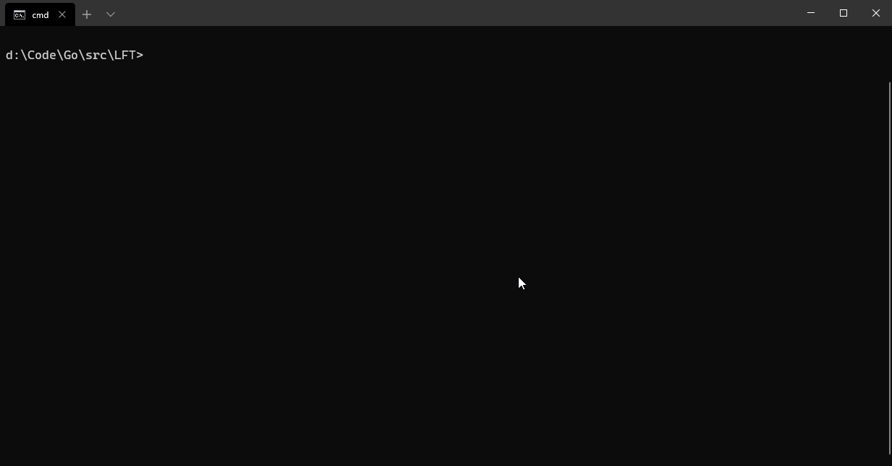
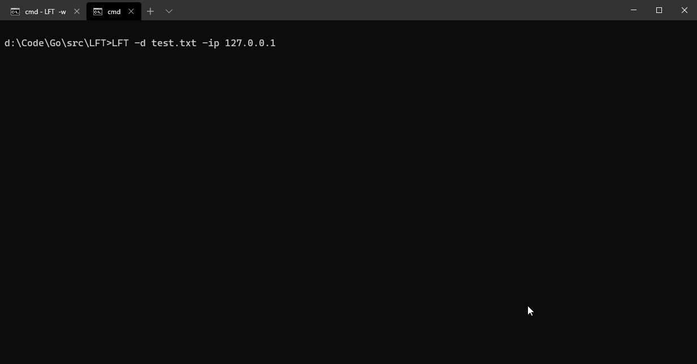
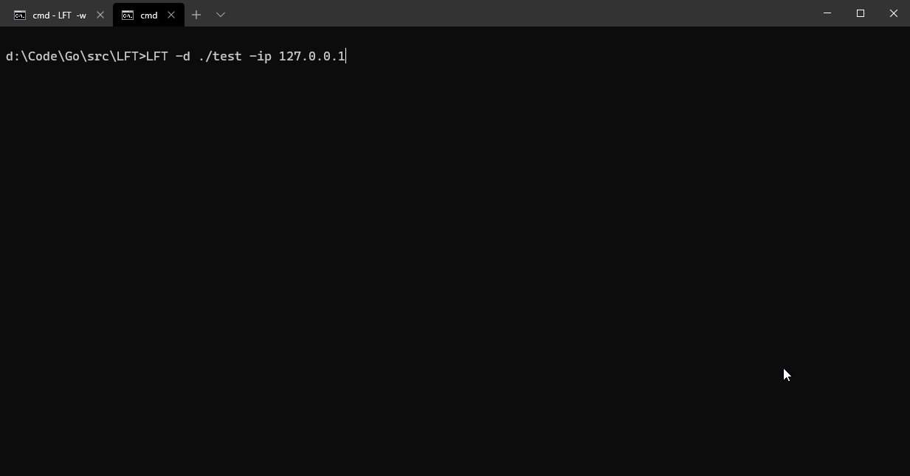
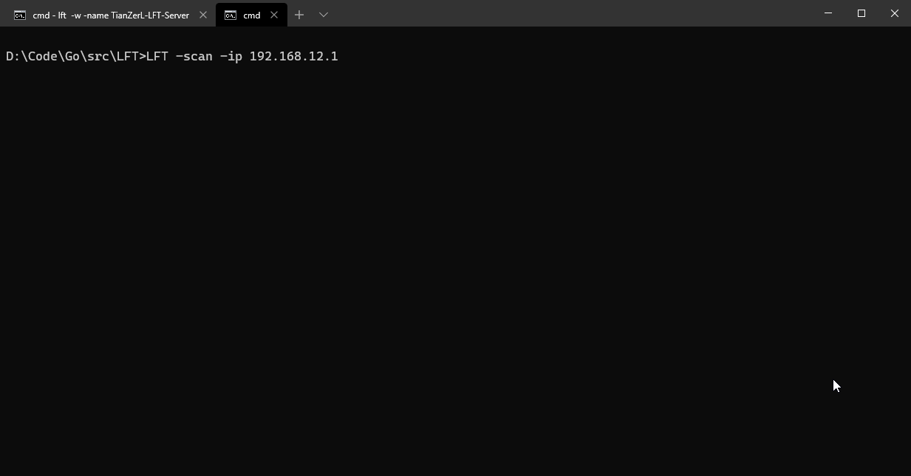

# LFT - *LAN files transferor*
LFT is a simple cli tool to transfer your files in LAN, also works in WAN, based on Go.  
It can be called as *LAN files transferor* :joy:.

# Feature
- [x] Send a file
- [x] Send directory
- [x] Scan server
- [ ] GUI

# Example
Start a server:  

Send a file:

Send a directory

Scan servers:


# Usage
## Start a server
Quick start:
```
LFT -w  
```
Set a name to your server:  
```
LFT -w -name [your server name] 
```
Specify port:  
```
LFT -w -port [specify port]
```
Specify listening IP:
```
LFT -w -ip [specify IP]
```
## Send a file or directory
Quick start:
```
LFT -d [source path] -ip [server ip]  
```
Specify port:  
```
LFT -d [source path] -ip [server ip] -port [specify port]
```
## Scan servers
```
LFT -scan -ip [destination IP list] -port [destination port list]
```
**Attention**:  
In IP list and port list, use ***","*** to separate. For example, you can input ***"192.168.1.1,192.168.2.1,192.168.3.1"*** and ***"6981,6980,6979"*** etc.  
The LFT will automatically scan the IP segment of each inputted ip and port. For example, inputting ***"192.168.1.1"*** means to scan ***"192.168.1.0"*** to ***"192.168.1.255"***.  
The port can be defaulted, it will be the default port ***6981***.
## More arguments
```
  -?    Display help information
  -d string
        Source or destination (default "./receive/")
  -h    Display help information
  -ip string
        Server IP address (default "0.0.0.0")
  -name string
        Set a name to your server (default "LFT-Server")
  -port string
        Server Port (default "6981")
  -scan
        Scan Lan to find servers
  -w    Start a server
```

# Install
```
go get -v github.com/TianZerL/LFT
```

# Author
TianZerL

# License
LGPL-3.0